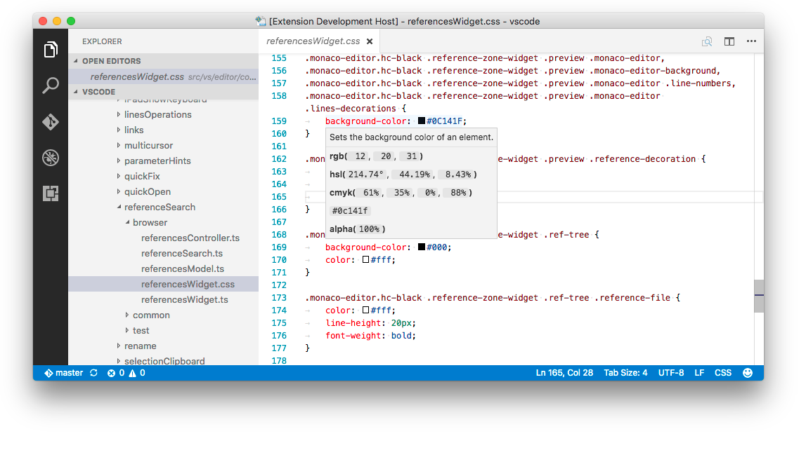
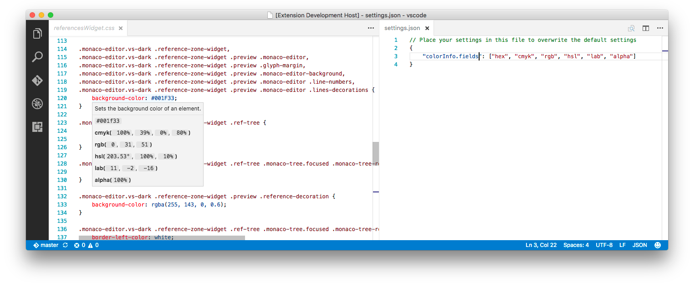
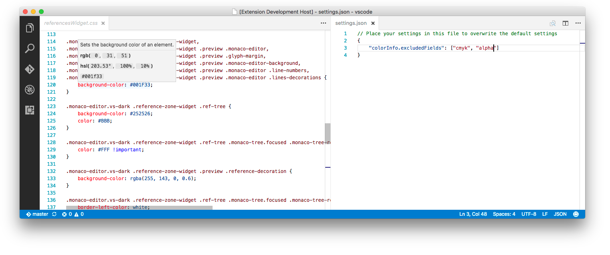

# VSCode Color Info

[Visual Studio Code](https://code.visualstudio.com) extension that provides quick information of colors in any programming language.

## About
*Color Info* adds additional information when you hover over a css color, including:

* `rgb` – RGB color values. Enabled by default
* `hsl` – HSL color values. Enabled by default
* `css-color-name` - Name of the color (`red`, `blue`, ...).
* `hsv` – HSV color values
* `lab` – LAB color values
* `lch` – LCHab color values
* `cmyk` – CMYK color values. Enabled by default
* `hex` – Hex value. Enabled by default
* `alpha` – Alpha value. Enabled by default
* `preview` – Preview of the color. Displays color with alpha in lower left corner and color without alpha in upper right corner. Enabled by default
* `preview-xl` – Larger preview of the color
* `preview-square` – Square preview of the color
* `preview-square-xl` – Larger square preview of the color

You can customize which of these fields are displayed and the order they are displayed in using the settings described below.

By default, the extension works with any css, sass, scss, or less document and recognizes all basic css color formats, including named colors. You can also enable Color Info in additional file types using the `colorInfo.languages` setting

## Configuration

#### `colorInfo.fields`
Ordered array of color fields to display.

#### `colorInfo.excludedFields`
Array of fields not to display. Overrides `colorInfo.fields`. If you only need to exclude one or two of the default fields, using `colorInfo.excludedFields` is the preferred approach.

#### `colorInfo.languages`
Defines which files and languages have color info enabled, and which color types are supported.

Each element consists of:

* `"selector"` - [VSCode document selector](https://code.visualstudio.com/Docs/extensionAPI/vscode-api#DocumentSelector).
* `"colors"` - String or array of strings defining the types of colors to display information for. Valid values color types are:

    * `css` - All css color value types
    * `hex` - Css hex (`#ff00ff` or `#f0f`)
    * `hex+alpha` - Css hex plus alpha (`#ff00ff77` or `#f0f7`)
    * `numhex` - Numeric hex (`0xFFAABB`)
    * `numhex+alpha` - Numeric hex plus alpha (`0xFFAABBEE`)
    * `rgb` - Css rgb or rgba (`rgb(1, 2, 3)` or `rgba(1, 2, 3, 0.5)`) 
    * `hsl` - Css hsl or hsla (`hsl(1, 2, 3)` or  `hsla(1, 2, 3, 0.5)`)
    * `css-colors-names` - Css color names (`red`, `blue`)

The default language setting enables all color values for the following file types:

* `css` - CSS stylesheets
* `sass` - Sass stylesheets
* `less` - LESS stylesheets
* `html` - HTML templates
* `js` - JavaScript
* `ts` - TypeScript
* `cs` - C#
* `java` - Java
