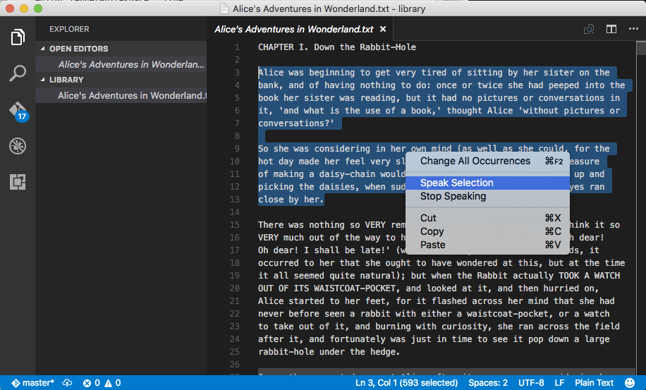
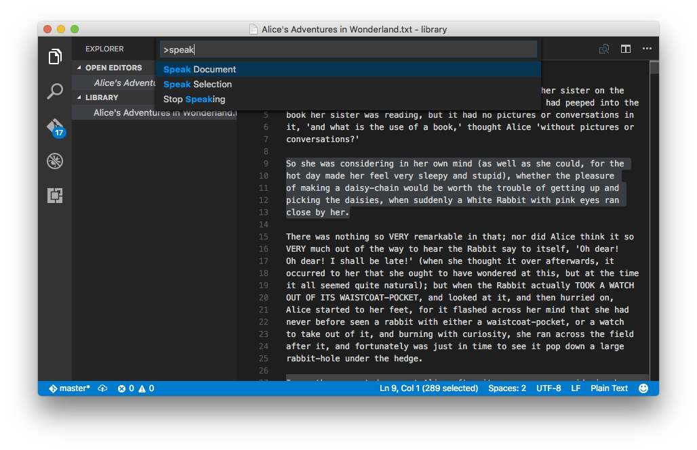
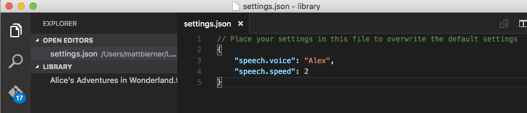

# VSCode Speech

Simple text-to-speech extension for [Visual Studio Code](https://code.visualstudio.com).

## About
VSCode Speech adds basic text-to-speech functionality to the VSCode editor using your operating system's built-in text-to-speech facilities.



It can either read the entire current document, or just the currently selected text.




## Configuration
By default, VSCode Speech uses whatever voice settings you have configured for your operating system. You can change the voice used to read text by [using some VSCode settings](https://code.visualstudio.com/docs/customization/userandworkspace)



#### `speech.voice`
Name of the voice used to read back text. If null, this defaults to the current system voice. 

For a list of available voices, on a Mac either:

1. Open `System Preferences`
2. Go to `Dictation & Speech`
3. Open the `Text to Speech` tab
4. Browse the system voice selections

or, in a command line run:

```bash
$ say -v ?
```

Here's example output for Mac OS 10.11:

```
Agnes               en_US    # Isn't it nice to have a computer that will talk to you?
Albert              en_US    #  I have a frog in my throat. No, I mean a real frog!
Alex                en_US    # Most people recognize me by my voice.
Alice               it_IT    # Salve, mi chiamo Alice e sono una voce italiana.
Alva                sv_SE    # Hej, jag heter Alva. Jag är en svensk röst.
Amelie              fr_CA    # Bonjour, je m’appelle Amelie. Je suis une voix canadienne.
Anna                de_DE    # Hallo, ich heiße Anna und ich bin eine deutsche Stimme.
Bad News            en_US    # The light you see at the end of the tunnel is the headlamp of a fast approaching train.
Bahh                en_US    # Do not pull the wool over my eyes.
Bells               en_US    # Time flies when you are having fun.
Boing               en_US    # Spring has sprung, fall has fell, winter's here and it's colder than usual.
Bruce               en_US    # I sure like being inside this fancy computer
Bubbles             en_US    # Pull the plug! I'm drowning!
Carmit              he_IL    # שלום. קוראים לי כרמית, ואני קול בשפה העברית.
Cellos              en_US    # Doo da doo da dum dee dee doodly doo dum dum dum doo da doo da doo da doo da doo da doo da doo
Damayanti           id_ID    # Halo, nama saya Damayanti. Saya berbahasa Indonesia.
Daniel              en_GB    # Hello, my name is Daniel. I am a British-English voice.
Deranged            en_US    # I need to go on a really long vacation.
Diego               es_AR    # Hola, me llamo Diego y soy una voz española.
Ellen               nl_BE    # Hallo, mijn naam is Ellen. Ik ben een Belgische stem.
Fiona               en-scotland # Hello, my name is Fiona. I am a Scottish-English voice.
Fred                en_US    # I sure like being inside this fancy computer
Good News           en_US    # Congratulations you just won the sweepstakes and you don't have to pay income tax again.
Hysterical          en_US    # Please stop tickling me!
Ioana               ro_RO    # Bună, mă cheamă Ioana . Sunt o voce românească.
Joana               pt_PT    # Olá, chamo-me Joana e dou voz ao português falado em Portugal.
Junior              en_US    # My favorite food is pizza.
Kanya               th_TH    # สวัสดีค่ะ ดิฉันชื่อKanya
Karen               en_AU    # Hello, my name is Karen. I am an Australian-English voice.
Kathy               en_US    # Isn't it nice to have a computer that will talk to you?
Kyoko               ja_JP    # こんにちは、私の名前はKyokoです。日本語の音声をお届けします。
Laura               sk_SK    # Ahoj. Volám sa Laura . Som hlas v slovenskom jazyku.
Lekha               hi_IN    # नमस्कार, मेरा नाम लेखा है.Lekha मै हिंदी मे बोलने वाली आवाज़ हूँ.
Luciana             pt_BR    # Olá, o meu nome é Luciana e a minha voz corresponde ao português que é falado no Brasil
Maged               ar_SA    # مرحبًا اسمي Maged. أنا عربي من السعودية.
Mariska             hu_HU    # Üdvözlöm! Mariska vagyok. Én vagyok a magyar hang.
Mei-Jia             zh_TW    # 您好，我叫美佳。我說國語。
Melina              el_GR    # Γεια σας, ονομάζομαι Melina. Είμαι μια ελληνική φωνή.
Milena              ru_RU    # Здравствуйте, меня зовут Milena. Я – русский голос системы.
Moira               en_IE    # Hello, my name is Moira. I am an Irish-English voice.
Monica              es_ES    # Hola, me llamo Monica y soy una voz española.
Nora                nb_NO    # Hei, jeg heter Nora. Jeg er en norsk stemme.
Paulina             es_MX    # Hola, me llamo Paulina y soy una voz mexicana.
Pipe Organ          en_US    # We must rejoice in this morbid voice.
Princess            en_US    # When I grow up I'm going to be a scientist.
Ralph               en_US    # The sum of the squares of the legs of a right triangle is equal to the square of the hypotenuse.
Samantha            en_US    # Hello, my name is Samantha. I am an American-English voice.
Sara                da_DK    # Hej, jeg hedder Sara. Jeg er en dansk stemme.
Satu                fi_FI    # Hei, minun nimeni on Satu. Olen suomalainen ääni.
Sin-ji              zh_HK    # 您好，我叫 Sin-ji。我講廣東話。
Tessa               en_ZA    # Hello, my name is Tessa. I am a South African-English voice.
Thomas              fr_FR    # Bonjour, je m’appelle Thomas. Je suis une voix française.
Ting-Ting           zh_CN    # 您好，我叫Ting-Ting。我讲中文普通话。
Trinoids            en_US    # We cannot communicate with these carbon units.
Veena               en_IN    # Hello, my name is Veena. I am an Indian-English voice.
Vicki               en_US    # Isn't it nice to have a computer that will talk to you?
Victoria            en_US    # Isn't it nice to have a computer that will talk to you?
Whisper             en_US    # Pssssst, hey you, Yeah you, Who do ya think I'm talking to, the mouse?
Xander              nl_NL    # Hallo, mijn naam is Xander. Ik ben een Nederlandse stem.
Yelda               tr_TR    # Merhaba, benim adım Yelda. Ben Türkçe bir sesim.
Yuna                ko_KR    # 안녕하세요. 제 이름은 Yuna입니다. 저는 한국어 음성입니다.
Zarvox              en_US    # That looks like a peaceful planet.
Zosia               pl_PL    # Witaj. Mam na imię Zosia, jestem głosem kobiecym dla języka polskiego.
Zuzana              cs_CZ    # Dobrý den, jmenuji se Zuzana. Jsem český hlas.
```

On Windows, from a command prompt run:

```bat
powershell "Add-Type -AssemblyName System.speech;" ^
    "$speak = New-Object System.Speech.Synthesis.SpeechSynthesizer;" ^
    "$speak.GetInstalledVoices()" ^
    "| foreach  { $_.VoiceInfo.Name }"
```

Example output:

```
Microsoft David Desktop
Microsoft Zira Desktop
```

#### `speech.speed`
Speed multiplier for the voice. Defaults to the operating system's default rate.

`1` reads at the standard rate, `2` reads back twice as fast as normal, and `0.5` reads back half as fast as normal. 


## Credits
Text-to-speech integration provided by [say.js](https://github.com/Marak/say.js/)

